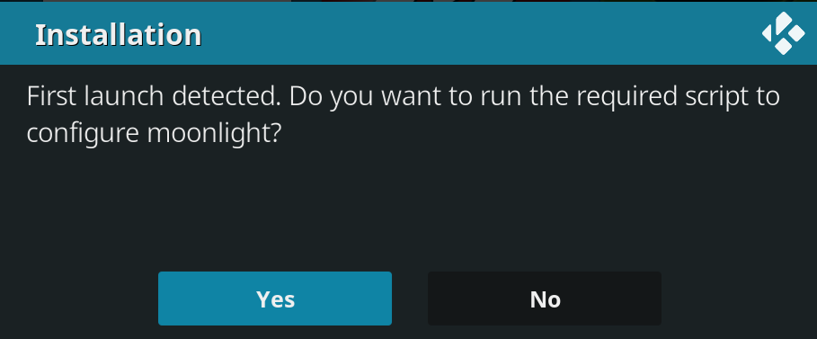
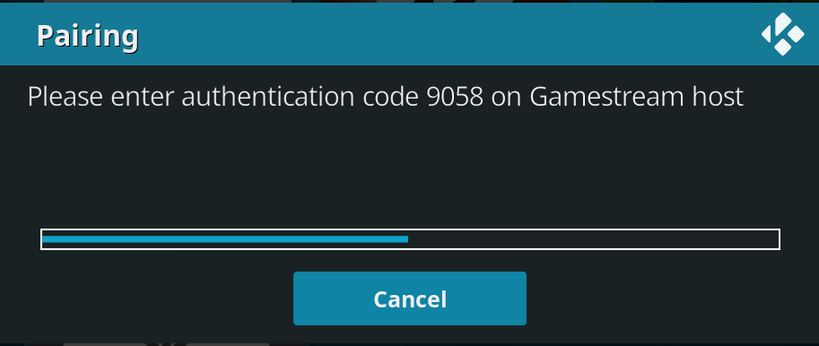
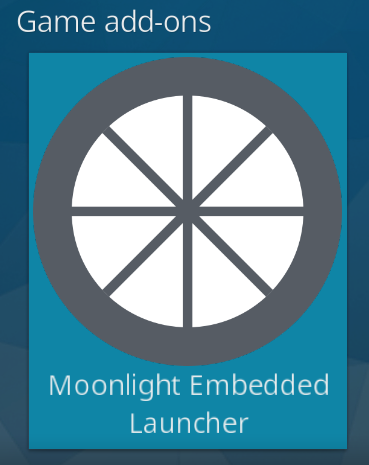

# script.moonlight-embedded-launcher
Docker container/Kodi launcher for running moonlight-embedded on LibreELEC/Raspberry Pi systems.

## Background:
This Docker container/Kodi addon-on was developed to enable moonlight game streaming on LibreELEC systems.  Since LibreELEC is a "just enough" distribution dependencies for moonlight-embedded are missing, requiring the use of a Docker container to run.  This add-on lets you launch moonlight-embedded from within Kodi and stream games/programs from your PC to your LibreELEC device.
More info on moonlight-embedded can be found here:
https://github.com/moonlight-stream/moonlight-embedded

## Prerequisites:
- Raspberry Pi 2, 3 or 4 device with LibreELEC 9 installed, connected to local network via ethernet (preferred) or wifi. (Note that Raspberry Pi 4 devices can run the full featured moonlight-qt, see this repository for more info: https://github.com/veldenb/plugin.program.moonlight-qt)
- Gaming PC with Steam and Nvidia GeForce Experience installed, connected to local network via ethernet (preferred) or wifi
- Basic familiarity with ssh and terminal for installation

## Instructions:
1. Enable Nvidia Gamestream on your gaming PC
```
GeForce Experience/Settings/Shield/Gamestream (move slider to right)
```
2. In Kodi install Docker from the LibreELEC repository.  Then REBOOT your device to make sure the Docker libraries are loaded.
```
Add-ons / Install from repository / LibreELEC Add-ons / Services / Docker
```
3. SSH into your LibreELEC device, download/extract the latest release of this repository to your LibreELEC device. Then install via zip file inside the Kodi gui.
```sh
wget https://github.com/clarkemw/script.moonlight-embedded-launcher/archive/v1.1/script.moonlight-embedded-launcher-1.1.zip
```
```
Kodi/Add-ons/Install from zip file/Select script.moonlight-embedded-launcher-1.1.zip
```
4. Upon first launch of the addon an installer process will launch to download/configure the Docker container. This process will take a few minutes as the Docker container is fairly large. See https://github.com/clarkemw/moonlight-embedded-raspbian-docker for details.


5. The next step is pairing with the Gamestream host.  Ensure that the host is on and connected to the local network. Then start the pairing process by selecting `Yes`. You will be prompted with an authentication code in the Kodi gui. Enter this code in the popup that appears on the Gamestream host.

  
Visit `Configure/Pair` in the GUI if you ever need to register a new Gamestream host. 

6. Launch moonlight-embedded from within Kodi and enjoy your game streaming experience. Select `Play Game` and follow the prompts to play any game registered with gamestream.  Select `Configure` to pair with a new host, update the Docker container or adjust settings (resolution, framerate, bitrate, custom IPs, custom moonlight flags etc).
```
Kodi/Add-ons/Game add-ons/Moonlight Embedded Launcher
```
  

7. Kodi will automatically relaunch when the application you are streaming closes. For example: select the power icon in the Steam gui to end the streaming session.

## Troubleshooting:
TBD
